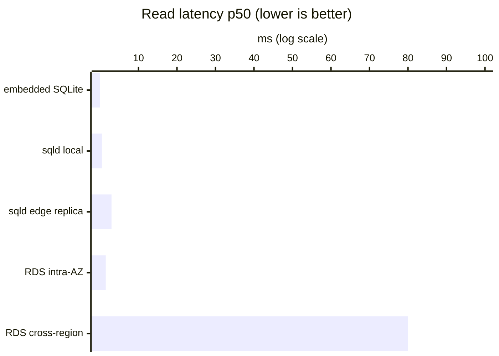

import { Aside } from '@astrojs/starlight/components';

This page collects published latency and throughput numbers for the three
databases sqlitedeploy users tend to compare: **embedded SQLite**,
**sqlitedeploy (libSQL/sqld over Hrana)**, and **managed PostgreSQL** on
RDS-class hardware. Every figure links back to a primary source so you can
verify or update it.

<Aside type="caution">
	Workload shape dominates everything below. p50 numbers for indexed
	point-reads have very little to do with throughput on a 5-table join,
	and a single-instance pgbench run on a t4g is not a benchmark of
	"Postgres." Treat these as *order-of-magnitude reference points*, not
	a leaderboard.
</Aside>

## TL;DR

| System                                | Read p50 (point query) | Write p50 (single row) | Sustained throughput[^1]      |
| ------------------------------------- | ---------------------- | ---------------------- | ----------------------------- |
| Embedded SQLite (WAL mode)            | `<1 µs` cached, ~50 µs cold | ~0.5 ms (WAL fsync)  | ~80–100k writes/sec, 100k+ reads/sec |
| sqlitedeploy primary, local network   | ~0.3–1 ms              | ~1–3 ms                | ~10–30k writes/sec ceiling    |
| sqlitedeploy edge replica             | ~1–5 ms (region-local) | n/a (writes go to primary) | scales linearly with replicas |
| Managed Postgres (RDS, intra-AZ)      | ~0.5–2 ms              | ~1–3 ms (single-AZ)    | ~400–3,000 TPS pgbench (small instance) |
| Managed Postgres (RDS, Multi-AZ)      | ~0.5–2 ms              | ~5–15 ms (sync replication) | similar TPS, half the write headroom |

[^1]: Throughput numbers are heavily workload-dependent. See sections below.

## Read latency

p50 read latency by tier — log scale, lower is better:

- **Embedded SQLite.** With the page cache hot, indexed point reads land
  in `<1 µs` because they're a memory dereference. Cold reads from disk are
  ~50–100 µs on NVMe. SQLite can sustain
  [100k+ SELECTs/sec on a single connection](https://phiresky.github.io/blog/2020/sqlite-performance-tuning/)
  with proper indexes and `PRAGMA mmap_size`.
- **sqlitedeploy primary, local.** Reads go through the Hrana protocol
  over HTTP. On loopback or same-LAN, p50 is dominated by HTTP framing and
  lands at ~0.3–1 ms. Same SQLite engine underneath, so the work is
  identical — the cost is the wire.
- **sqlitedeploy edge replica.** A read served by a replica in the user's
  region is ~1–5 ms p50 — close to a CDN cache hit, because it
  effectively is one. Replica WAL lag is sub-second on a healthy network
  (see [Read replicas](/guides/replicas/)).
- **Managed Postgres (RDS), intra-AZ.** Indexed PK fetches over a warm
  connection are typically 0.5–2 ms. Connection setup adds 50–200 ms cold
  — this is why every Postgres-serious app runs PgBouncer or RDS Proxy.
- **Postgres cross-region.** Latency = round-trip time. Transcontinental is
  60–100 ms minimum, so cross-region reads against a single Postgres
  primary are why people end up sharding or running read replicas
  themselves. sqlitedeploy gets edge reads "for free" because that's the
  whole architecture.

## Write latency

- **Embedded SQLite (WAL + fsync).** A committed write is bounded by one
  fsync. On NVMe that's 0.5–2 ms;
  [SQLite User Forum measurements show p99 ~0.5 ms in WAL mode](https://sqlite.org/forum/info/117c91891cf7ac15)
  vs ~20 ms in legacy rollback-journal mode.
- **sqlitedeploy via Hrana, primary co-located.** Add HTTP framing on top
  of the local fsync — usually 1–3 ms.
- **sqlitedeploy via Hrana, primary remote.** RTT-bound. Writing from a
  Cloudflare Worker in IAD to a primary in FRA is ~80 ms whatever you do.
  This is the trade you make: replicas can be everywhere; the primary is
  one place.
- **Postgres, `synchronous_commit=on`, single-AZ.** ~1–3 ms per commit
  intra-AZ.
- **Postgres Multi-AZ on RDS.** Commits wait for the synchronous standby —
  usually 5–15 ms p50, with tail latency that grows under cross-AZ network
  weather.
- **Aurora.** Writes go through a 6-way quorum to storage. Typical 2–10 ms,
  more consistent tail than Multi-AZ RDS at the cost of being more
  expensive.

<Aside type="note">
	sqld's bottomless WAL ship to S3/R2/B2 is **asynchronous**. Commits
	don't wait for the bucket. That's why the latency above is just
	"Hrana + local fsync" — the durability story is "your last few
	seconds of writes can be lost on a primary crash." If you need
	synchronous durability to object storage, sqld is not the right tool.
	See the caution box on
	[How it works](/guides/how-it-works/#bottomless).
</Aside>

## Throughput

### Embedded SQLite

A single SQLite process tuned with WAL, large `mmap_size`, and batched
transactions can sustain
[~80,000 writes/sec and 100k+ reads/sec](https://highperformancesqlite.com/watch/wal-vs-journal-benchmarks)
on commodity NVMe. The ceiling is the underlying fsync rate, not the SQL
engine. **One writer at a time** — SQLite serializes write transactions.

### sqlitedeploy (sqld)

The libSQL server adds Hrana framing and connection management on top of
SQLite. Practical write ceiling on a single primary is in the
**~10,000–30,000 Hrana writes/sec** range for indexed inserts, depending
on payload size, network, and how aggressively the client batches. Read
throughput scales horizontally by adding replicas — each replica serves
its own read traffic, so 5 edge replicas roughly = 5× the read RPS of the
primary alone.

The Turso team's
[Turso Sync benchmark (2026)](https://turso.tech/blog/sync-benchmark)
measures 200 read-your-writes cycles at `<1 ms` per cycle on Turso vs 243 ms
on the older Embedded Replicas approach — the relevant takeaway for
sqlitedeploy users is that the Hrana request path is sub-millisecond on
the wire, so your tail latency budget is mostly your own network.

### Managed PostgreSQL

`pgbench` TPC-B numbers vary across an order of magnitude depending on
hardware and tuning. Common ranges from
[community benchmarks](https://medium.com/@mehmanjafarov1905/benchmarking-postgresql-with-pgbench-f6a53b84c9cf):

- t4g.small (2 vCPU, 2 GB): a few hundred TPS with default tuning
- m6g.large (2 vCPU, 8 GB): ~2,500–5,000 TPS
- m6g.4xlarge and up: tens of thousands of TPS at the cost of dollars/hour

Aurora typically lands in the same band as RDS for write TPS; its
advantage is consistency under failure and read-replica latency, not raw
throughput.

## Where each system breaks

**sqlitedeploy / libSQL**

- One writer. There is no path to multi-writer; replicas are read-only.
- No advanced concurrency primitives (`SELECT FOR UPDATE`, advisory locks
  in the Postgres sense, listen/notify).
- Schema migration patterns are more limited — `ALTER TABLE` in SQLite
  has known sharp edges around column drops and constraint changes.
- Async durability to bucket — last few seconds of writes can be lost.

**Managed Postgres**

- Cold-start on serverless flavors. Aurora Serverless v2 takes
  [~15 seconds to wake from min=0 ACU](https://repost.aws/questions/QUbtHMLZXiS4Kppi7KMIB5YQ/aurora-serverless-v2-minimum-cost-setup-for-development-environment),
  which is fine for dev/test and not fine for user-facing production.
- Connection overhead. Without PgBouncer/RDS Proxy, lots of short-lived
  Lambda/Worker invocations exhaust the connection pool quickly.
- IOPS ceilings on burstable (`t4g`) instances — if your workload bursts
  past the credit balance, throughput collapses.
- Edge reads cost extra: read replicas are billed compute, not free fan-out.

**Embedded SQLite alone**

- No networked access. One process owns the file.
- No replication, no point-in-time-recovery without bolt-on tooling.
- Concurrent processes serialize on the WAL — fine within one app, hard
  across services.

## What this means for your workload

| Workload                                                       | Best fit                  |
| -------------------------------------------------------------- | ------------------------- |
| Embedded / on-device / single-tenant single-process            | Plain SQLite              |
| Read-heavy with users in many regions, one write region        | sqlitedeploy with replicas |
| Write-heavy single-region, complex queries (CTEs, JSONB index, window funcs, RLS) | Managed Postgres |
| Idle most of the time, occasional bursts                       | Neon (scale-to-zero) or sqlitedeploy on a small VM |
| Strict cross-region durability, multi-writer required          | Postgres / Aurora / Spanner |

If your app fits the second row, sqlitedeploy's architecture is doing real
work — edge reads come out of replicas at ~1–5 ms, and you only pay for
one VM + a bucket. If it fits the third or fifth row, it doesn't matter
how cheap sqlitedeploy is; pick Postgres.

## Sources

- [SQLite User Forum — WAL vs journal mode latency](https://sqlite.org/forum/info/117c91891cf7ac15)
- [phiresky — SQLite performance tuning, 100k SELECT/sec](https://phiresky.github.io/blog/2020/sqlite-performance-tuning/)
- [High Performance SQLite — WAL vs journal benchmarks](https://highperformancesqlite.com/watch/wal-vs-journal-benchmarks)
- [Turso Sync benchmark, April 2026](https://turso.tech/blog/sync-benchmark)
- [PostgreSQL pgbench documentation](https://www.postgresql.org/docs/current/pgbench.html)
- [Benchmarking PostgreSQL with pgbench (community)](https://medium.com/@mehmanjafarov1905/benchmarking-postgresql-with-pgbench-f6a53b84c9cf)
- [Aurora Serverless v2 cold-start behavior, AWS re:Post](https://repost.aws/questions/QUbtHMLZXiS4Kppi7KMIB5YQ/aurora-serverless-v2-minimum-cost-setup-for-development-environment)
- [SQLite speed page (historical)](https://sqlite.org/speed.html)

<Aside type="tip">
	The most useful number is one you measured against your own queries.
	When you've shipped, run a load test through your real code path and
	compare to the bands above — they're the right ballpark, but ballparks
	have edges.
</Aside>
