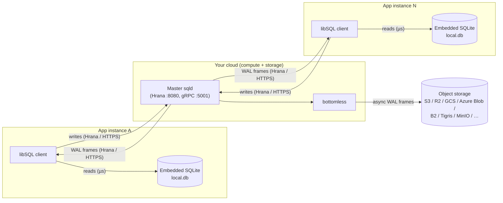
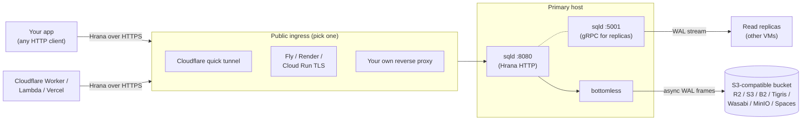

import { Aside } from '@astrojs/starlight/components';

`sqlitedeploy` is glue code. It composes four well-tested components into
a single CLI that's friendly to free tiers.

## Architecture: embedded replica + cloud master

Every long-running instance of your application embeds a libSQL client
backed by a local SQLite file. A single **master** sqld runs on the cloud
you picked — Fly VM, Cloud Run, ECS, Render, a home server, whatever. The
master owns the authoritative copy and ships WAL frames to the object
store you picked. The embedded copies pull those WAL frames on a
configurable interval so each app instance keeps a recent local replica.



### Reads stay local

The embedded SQLite is a real `.db` file in the application process.
Queries are direct syscalls against that file — no network, no driver
hop, microsecond p99. Read scaling is a property of the application's
own horizontal scaling: each new instance gets its own embedded replica
and reads scale linearly with the app fleet.

### Writes go to the master

INSERTs, UPDATEs, and DELETEs are sent over the
[Hrana protocol](https://github.com/tursodatabase/libsql/blob/main/docs/HRANA_3_SPEC.md)
to the master sqld. The master executes the write against its own
SQLite file, hands the WAL frames to bottomless for async durability,
and acknowledges the client. The initiating client reads its own write
against the local embedded replica as soon as the sync round-trip
completes — read-your-writes is preserved on the writing instance.

### Sync is pull-based WAL replication

Embedded replicas pull WAL frames over Hrana on the master's HTTP port
(:8080 in the component diagram below — the same endpoint they send
writes to), either on an explicit `sync()` call or on a configurable
`syncInterval`. Because both ends speak the same on-disk format, the
frames are applied byte-level to the local SQLite file — no SQL replay,
no logical-to-physical translation, no schema drift between replicas.
Cross-instance propagation is bounded by whatever interval the client
is configured with; tighter intervals mean fresher replicas at the cost
of more sync traffic. The :5001 gRPC port shown below is a separate
path used by replica **VMs** running sqld in replica mode, not by
embedded clients.

### The cloud-agnostic tweak

Turso's bottomless layer is hardwired to AWS S3 and to Turso's hosted
control plane. `sqlitedeploy` keeps the same WAL-shipping protocol but
puts a **pluggable storage provider interface** behind it. Today that
interface speaks any S3-compatible bucket — R2, B2, Tigris, Wasabi,
MinIO, Spaces — and the abstraction leaves room for native GCS and
Azure Blob backends without touching sqld or the sync path. "Your
preferred cloud" composes from two independent choices:

- **Compute** — wherever your master sqld runs.
- **Storage** — wherever WAL frames land.

Pick any combination. The rest of this page walks through the pieces
that make that work.

## The components



### sqld

The libSQL server. Owns the SQLite file, serves the
[Hrana protocol](https://github.com/tursodatabase/libsql/blob/main/docs/HRANA_3_SPEC.md)
over HTTP and WebSocket on port 8080, and serves a gRPC stream on 5001 that
read replicas pull WAL frames from.

`sqlitedeploy` ships pre-built sqld binaries for Linux x64, Linux ARM64,
and macOS, so you don't compile anything.

### bottomless

A subsystem of sqld that asynchronously ships WAL frames to S3-compatible
object storage. On startup, sqld can rebuild the database from the bucket
(`--sync-from-storage`) — that's how you cold-restore.

<Aside type="caution">
	Bottomless is **async durable**: the last few seconds of writes can be
	lost if the primary crashes before the next flush. For workloads that
	require strict durability, run sqld with `WAL fsync` enabled and accept
	the latency cost.
</Aside>

### JWT auth

Every connection to sqld is gated by an Ed25519-signed JWT. The CLI:

1. Generates a keypair on first `up` (saved to `.sqlitedeploy/auth/`).
2. Mints a long-lived **replica token** (`.sqlitedeploy/auth/replica.jwt`)
   that read replicas and apps use to authenticate.
3. Passes the **public** key to sqld via `--auth-jwt-key-file` so sqld can
   verify tokens without holding the private key.

If you lose the private key, you can't mint new tokens — back it up.

### Public ingress

`sqlitedeploy` separates "where sqld runs" from "how clients reach it."
Two modes ship today, picked with `--ingress`:

- **`--ingress=tunnel`** (default). Skips the "buy a domain, configure DNS,
  terminate TLS" yak-shave: `up` shells out to `cloudflared` and opens a
  free **quick tunnel**. You get a `https://random.trycloudflare.com` URL
  pointed at sqld. Works anywhere with outbound HTTPS — laptop, home
  server, container with no public IP. The hostname rotates on each run.
- **`--ingress=listen`**. sqld binds a public port and your platform's
  existing HTTPS handles the public URL — Fly auto-TLS, Render's
  `*.onrender.com`, Railway, Cloud Run, ECS+ALB, your own Caddy/nginx.
  `sqlitedeploy` provisions nothing on the ingress side. Pair with
  `--public-url=https://your-domain.example` so the success banner shows
  the URL clients will actually use. See
  [Deploy](/guides/deploy/) for per-platform recipes.

The two modes are independent of the storage choice — pick any combination
of `--provider` and `--ingress`.

## What `up` actually does

Under the hood, `sqlitedeploy up` runs roughly this sequence
(see [`internal/cli/up.go`](https://github.com/Khangdang1690/sqlitedeploy/blob/main/internal/cli/up.go)):

```
  config exists?
    └── yes: load it, skip provisioning
    └── no:  provision storage (R2 bucket + scoped key) → save .sqlitedeploy/config.yml

  bootstrap auth (idempotent)
    └── generate Ed25519 keypair if missing
    └── mint replica.jwt if missing

  spawn sqld with PrimaryOpts
    └── --http-listen-addr      127.0.0.1:8080
    └── --grpc-listen-addr      0.0.0.0:5001
    └── --auth-jwt-key-file     .sqlitedeploy/auth/jwt_public.pem
    └── env LIBSQL_BOTTOMLESS_*  (provider creds)

  wait for :8080 to accept TCP
    └── timeout 15s

  start ingress driver:
    └── --ingress=tunnel: shell out to `cloudflared tunnel --url http://127.0.0.1:8080`,
                         parse public URL from stdout
    └── --ingress=listen: noop — your platform's ingress is already in front

  print summary, hand off to user (Ctrl-C to stop)
```

There is no daemon, no background process, no agent. Stop the foreground
process and the tunnel goes down with it; sqld and bottomless keep your
data on the local SQLite file and (asynchronously) in the bucket.
